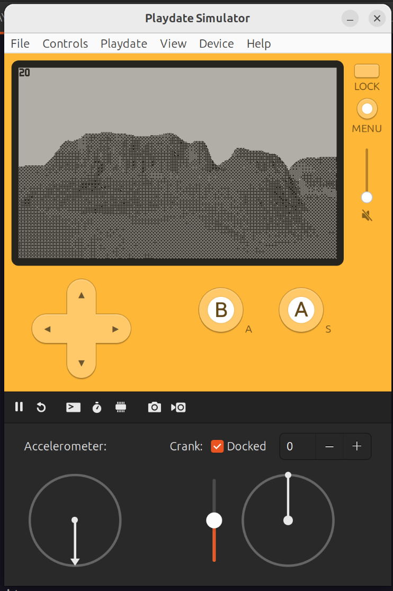

### A prototype game using the voxelspace algorithm on the playdate console.

### Run the game
[Binary for sideloading](<https://github.com/webmobster/voxelspaceplaydate/raw/master/Voxel%20Space%20Playdate.pdx.zip>)

### Build the game
1. Install rust nightly using rustup
2. "git clone crankstart" to init crankstart in the repo as a subdir
3. "cargo install --git=https://github.com/pd-rs/crank"
4. "rustup +nightly target add thumbv7em-none-eabihf"
5. "sudo apt install libnewlib-arm-none-eabi"
6. Install the SDK to "~/Developer/PlaydateSDK/"
7. "export PATH=$PATH:/home/ed/Developer/PlaydateSDK/bin" before running
8. You may need to set "export PLAYDATE_MOUNT_POINT=/media/$USER/PLAYDATE" to run on device
9. "crank run --release --device" (--help for other flags such as using the simulator) to run this on your device
